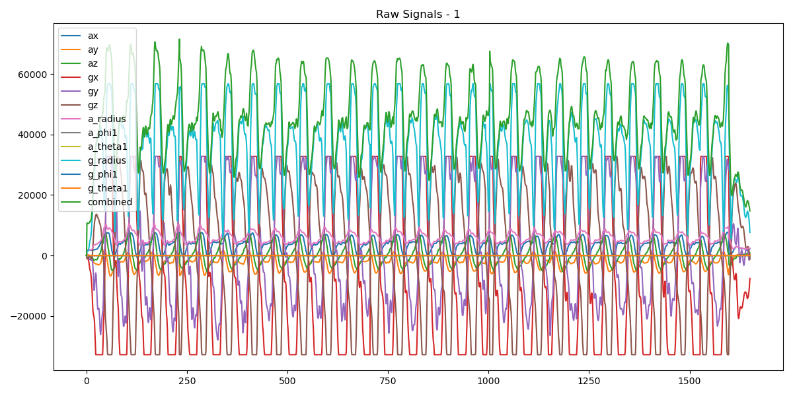
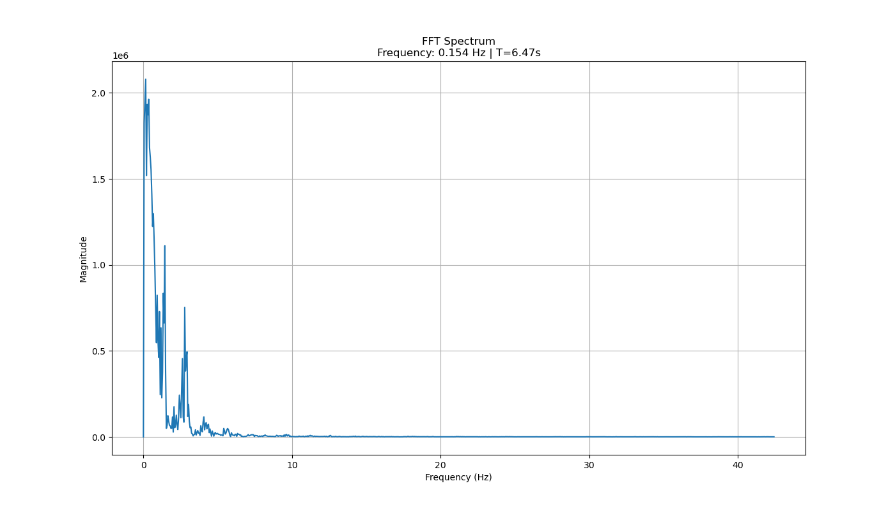
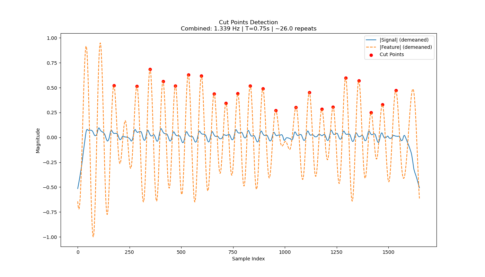
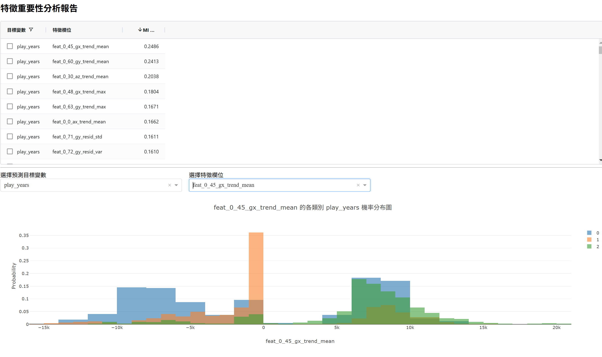
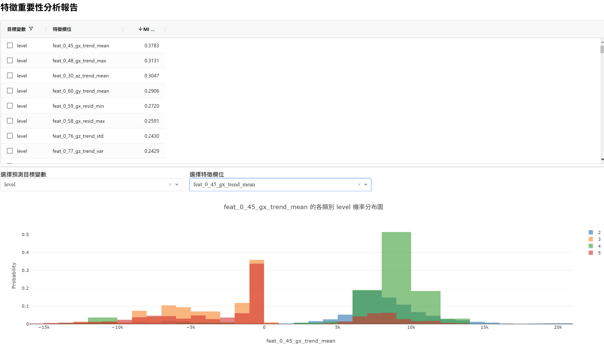
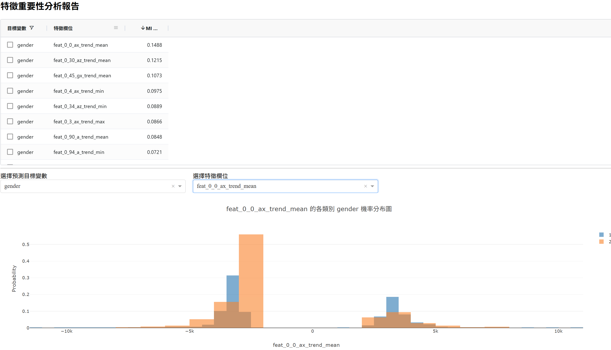
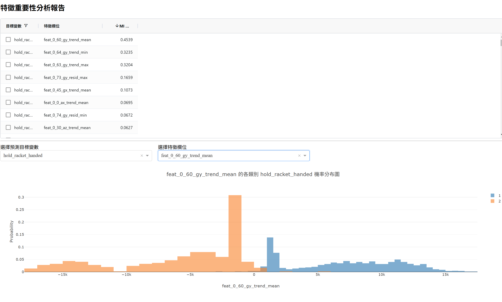

# 專案名稱：SmartPing AI 模型訓練與預測系統

## 🌿 競賽簡介

本專案為參與 **AI CUP 2025 春季賽－桌球智慧球拳資料的精準分析競賽** 而開發，目標為預測選手特徵，組合特徵分析與機器學習建模，實現自動化的預測系統。

---

## 🚀 快速上手指南

### 1. 安裝環境

建議 Python 版本：**Python >= 3.9**

```bash
pip install -r requirements.txt
```

### 2. 準備資料

1. 從 TBrain 官方網站下載訓練與測試資料。
2. 解壓縮後，將資料放入 `data/raw/` 資料夾。

### 3. 特徵工程處理

```bash
python scripts/process_data.py
```

輸出：`data/processed/` 內之特徵資料集。

### 4. 模型訓練與預測產出

```bash
python scripts/run_xgbtrainer.py
```

輸出：`outputs/submissions/submission_{時間戳記}.csv`

### 5. 上傳結果至 TBrain

將 CSV 檔上傳至競賽網站查看評分。

---

## 🧐 模型與特徵設計

* **模型使用**：`XGBoost`, `Random Forest`
* **特徵工程摘要**：
  * 讀取原始擊球訊號，包含三軸加速度與角速度
  * 三將三軸訊號轉換為半徑與角度，用於擴充特徵欄位
  * 使用 FFT 分析操作取得主頻率，幫助分割正常擊球周期和指定方向切割點
  * 對各軸訊號進行 STL 分解，分成「趨勢 (trend)」「週期 (seasonal)」「殘差 (resid)」
  * 對各分解結果計算 mean, std, var, max, min
  * 趨勢 (trend)：範圍 (range)、變化斜率 (slope)、能量指標 (energy)
  * 週期 (seasonal)：熱度深度 (entropy)、自相關度 (autocorr)、信號平常性 (ptp)
  * 殘差 (resid)：空間複雜度 (complexity)、過零率 (ZCR)

> 📊 範例分析圖表請見下方「分析圖表展示」區段

* **訓練策略**：

  * 以 GroupKFold 為基礎的 Cross Validation
  * 使用 Optuna 進行部分模型參數調校

---

## 📊 分析圖表展示

> 本專案於 `generate_features` 過程中自動產出下列分析圖表，提供特徵檢查與視覺化輔助：

* **Raw Signal 總覽圖**：檢視原始資料走勢
* **FFT 頻率圖**：顯示主頻率與震動週期
* **切割點偵測圖**：偵測完整揮拍訊號高峰處，取首尾 Cut Points 作為切割訊號範圍
* **任務特徵分析圖**：展示每個任務對應最高 MI 特徵與其機率分布情形

### 📎 圖例展示








---

## 📂 專案結構

```bash
.
├── data/
│   ├── raw/              # 原始訓練與測試資料
│   └── processed/        # 特徵處理後資料
├── outputs/
│   └── submissions/      # 預測結果（submission）
├── scripts/
│   ├── process_data.py   # 資料前處理與特徵建立
│   └── run_xgbtrainer.py # 模型訓練與預測產出
├── src/                  # 自訂模組與邏輯封裝（如資料轉換、模型類別）
├── requirements.txt      # 使用套件需求清單
└── README.md             # 說明文件
```

---

## 🗰 requirements.txt（自動產出）

```
pandas==2.2.1
numpy==1.26.4
xgboost==1.7.6
scikit-learn==1.4.2
optuna==3.5.0
tqdm==4.67.1
```

> 📌 本檔由 [pipreqs](https://github.com/bndr/pipreqs) 自動生成，僅列出實際使用到的外部套件。

---

## 🗒 私人成績紀錄

> 本專案於競賽結束時私人成績為：
>
> * Score（Private Leaderboard）：**0.791440**
> * 排名：約 **Top 50 名**

---

## 📝 參賽心得

參與本次競賽，收穫豐富，涵蓋多方面的技術與合作能力：

* 熟悉時間序列的頻譜分析與 STL 分解，擷取高品質特徵
* 嘗試以 Optuna 進行自動化模型參數調整
* 探索週期性訊號切片作為上採樣策略
* 運用 cross validation 分析模型泛化能力，並解決過擬合問題
* 與夥伴合作實作並使用 Git 管理專案，強化協作流程經驗

### 🤯 遇到的挑戰與解法

* 前期專注於信號分析與特徵建立，並以 MI score 評估特徵影響力
* 發現官方提供的 Cut Points 不具代表性，重新設計偵測演算法擷取穩定擊球段落
* 使用 cross validation 發現 validation 與 public test 分數差距大，定位模型過擬合
* 嘗試針對相同選手隨機切割子訊號進行上採樣，提升變異性並縮小分數差距至 < 0.03
* 雖然尚未有時間進行完整調參與模型改良，但已大幅改善泛化問題

---

## 📌 更新紀錄

* **2025-05-29**

  * 新增資料處理與特徵萌取模組
  * 整合 XGBoost 模型訓練與預測輸出
  * 統一 submission 輸出格式與資料夾架構

---

## 💡 備註

此專案可作為模型競賽的入門範例，展示如何進行資料分析、特徵設計與模型組合流程。

---

## 📬 聯絡資訊

如有相關問題或合作邀約，歡迎聯絡：

* 📧 Email：[yanxunzhou0927@gmail.com](mailto:yanxunzhou@gmail.com)
* 💼 GitHub：[https://github.com/YXZhou0927](https://github.com/YXZhou0927)

